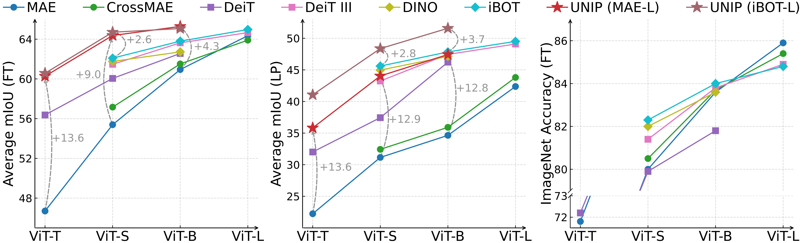

# UNIP

This repository contains the official pytorch implementation of the paper "[UNIP: Rethinking Pre-trained Attention Patterns for Infrared Semantic Segmentation](https://arxiv.org/abs/2502.02257)".


## 📖 Introduction


In this work, we first benchmark the infrared semantic segmentation performance of various pre-training methods and reveal several phenomena distinct from the RGB domain. Next, our layerwise analysis of pre-trained attention maps uncovers that: (1) There are three typical attention patterns (local, hybrid, and global); (2) Pre-training tasks notably influence the pattern distribution across layers; (3) The hybrid pattern is crucial for semantic segmentation as it attends to both nearby and foreground elements; (4) The texture bias impedes model generalization in infrared tasks. Building on these insights, we propose **UNIP,** a **UN**ified **I**nfrared **P**re-training framework, to enhance the pre-trained model performance. This framework uses the hybrid-attention distillation NMI-HAD as the pre-training target, a large-scale mixed dataset InfMix for pre-training, and a last-layer feature pyramid network LL-FPN for fine-tuning.


Experimental results show that UNIP outperforms various pre-training methods by up to **13.5%** in average mIoU on three infrared segmentation tasks, evaluated using fine-tuning and linear probing metrics. UNIP-S achieves performance on par with MAE-L while requiring only **1/10** of the computational cost. Furthermore, UNIP significantly surpasses state-of-the-art (SOTA) infrared or RGB segmentation methods and demonstrates the broad potential for application in other modalities, such as RGB and depth.




## 🛠️ Usage

### Pre-training

1. Create conda environments and install packages.

```bash
# create environment
conda create -n unip_pre python=3.9
conda activate unip_pre
# install pytorch and torchvision
conda install pytorch==2.2.0 torchvision==0.17.0 pytorch-cuda=12.1 -c pytorch -c nvidia
# install other packages
pip install -r UNIP_pretraining/requirements.txt
```

2. Training

- UNIP-S (MAE-L)

```bash
cd UNIP_pretraining
sh train_scripts/mae-l_distill_unip-s.sh
```

- UNIP-S (DINO-B)

```shell
cd UNIP_pretraining
sh train_scripts/dino-b_distill_unip-s.sh
```

- UNIP-S (iBOT-L)

```bash
cd UNIP_pretraining
sh train_scripts/ibot-l_distill_unip-s.sh
```

- UNIP-B (MAE-L)

```bash
cd UNIP_pretraining
sh train_scripts/mae-l_distill_unip-b.sh
```

- UNIP-T (MAE-L)

```bash
cd UNIP_pretraining
sh train_scripts/mae-l_distill_unip-t.sh
```

**Note**: Please download the pre-trained checkpoints of each teacher model from their official repositories, and change the `model_path`, `log_dir`, and `output_dir` in the training scripts.

### Semantic Segmentation

1. Create conda environments and install packages.

```bash
# create environment
conda create -n unip_seg python=3.8
conda activate unip_seg
# install pytorch and torchvision
conda install pytorch==1.8.0 torchvision==0.9.0 torchaudio==0.8.0 cudatoolkit=11.1 -c pytorch -c conda-forge
# install the mmsegmentation library
pip install mmcv-full==1.3.0 mmsegmentation==0.11.0
# install other packages
pip install -r UNIP_segmentation/requirements.txt
# install apex
git clone https://github.com/NVIDIA/apex
cd apex
pip install -v --disable-pip-version-check --no-cache-dir --no-build-isolation --config-settings "--global-option=--cpp_ext" --config-settings "--global-option=--cuda_ext" ./
```

2. Training

- UNIP-S

```bash
cd UNIP-segmentation
sh train_scripts/train_vit_small.sh
```

- UNIP-B

```bash
cd UNIP-segmentation
sh train_scripts/train_vit_base.sh
```

- UNIP-T

```bash
cd UNIP-segmentation
sh train_scripts/train_vit_tiny.sh
```

## Citation
If you find this repository helpful, please consider giving it a star and citing:
```bibtex
@inproceedings{
  zhang2025unip,
  title={{UNIP}: Rethinking Pre-trained Attention Patterns for Infrared Semantic Segmentation},
  author={Tao Zhang and Jinyong Wen and Zhen Chen and Kun Ding and Shiming Xiang and Chunhong Pan},
  booktitle={The Thirteenth International Conference on Learning Representations},
  year={2025},
  url={https://openreview.net/forum?id=Xq7gwsnhPT}
}
```

## Acknowledgements

This codebase is built upon the [MAE](https://github.com/facebookresearch/mae/tree/main) repository, the [iBOT](https://github.com/bytedance/ibot) repository, the [mmsegmentation](https://github.com/open-mmlab/mmsegmentation) repository, and the [PAD](https://github.com/casiatao/PAD) repository. Thanks for their contributions.

